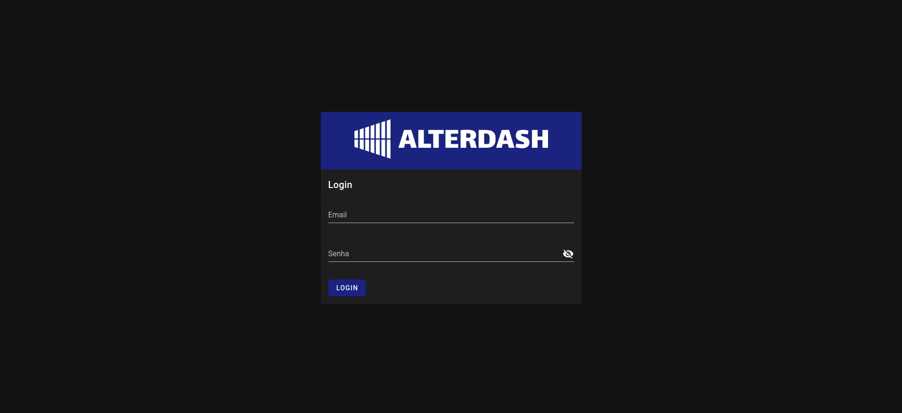

<br/>

# AlterDash

This project is a Vue2 application built with TypeScript. It uses Node.js and Yarn for package management. The application is also containerized using Docker. 

## Main Technologies

- [Node.js](https://nodejs.org/): JavaScript runtime built on Chrome's V8 JavaScript engine.
- [TypeScript](https://www.typescriptlang.org/): A typed superset of JavaScript that compiles to plain JavaScript.
- [Vue.js](https://vuejs.org/): A progressive JavaScript framework for building user interfaces.
- [Vuex](https://vuex.vuejs.org/): A state management pattern + library for Vue.js applications.
- [Jest](https://jestjs.io/): A JavaScript Testing Framework with a focus on simplicity.
- [Vuetify](https://vuetifyjs.com/): A Vue UI Library with beautifully handcrafted Material Components.

## Running the project

### Back-end

- Download the backend repository [here](https://github.com/WebersonRodrigues/backend-node-exemplo-memoria) 
- Install the backend dependencies with `npm i`
- Start the API with `yarn start`

### Front-end
- Download this repository
- Install dependencies: `yarn install`
- Run the application in development mode: `yarn start`
- Log in with user `admin@admin.com` and password `123456`

## Front-end with Docker

You may run this project with docker-compose. Use the following commands:
```docker
# for developement environment
docker-compose up alterdash_dev

# for production environment
docker-compose up alterdash_prod
```
## Other commands

- Build the application for production: `yarn build`
- Run unit tests: `yarn test:unit`
- Lint and fix files: `yarn lint

<br/>
Thanks!